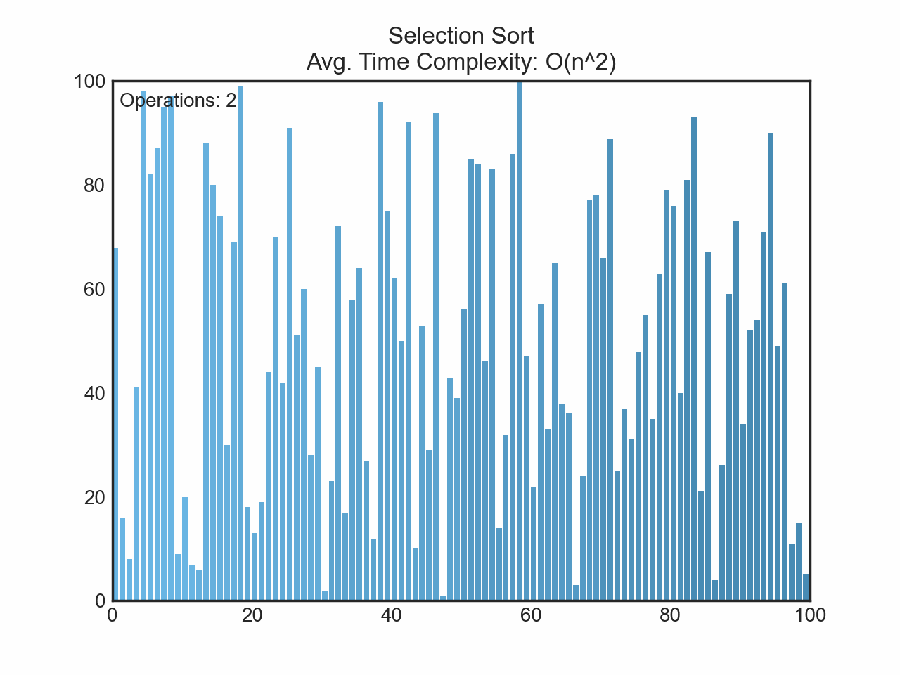

# Sorting Algorithm Visualizer

## Overview
This project is a sorting algorithm visualizer that provides an interactive and educational way to understand how various sorting algorithms work. It uses Matplotlib for creating visualizations and allows users to choose from different sorting algorithms such as Bubble Sort, Insertion Sort, Merge Sort, Quick Sort, and more. 

## Features
- Interactive visualization of sorting algorithms.
- Multiple sorting algorithms to choose from.
- User-friendly interface for selecting input size and sorting speed.
- Real-time updates on the number of operations performed.

## Getting Started
To get started with the visualizer, follow these steps:

### 1. Clone the repository:

`git clone https://github.com/your-username/sorting-algorithm-visualizer.git`

### 2. Install the required dependencies:
`pip install matplotlib`
### 3. Run the main script:
`python sorting_visualizer.py`
## Usage
- Choose the sorting algorithm and input size.
- Adjust sorting speed to visualize the algorithm step by step.
- Watch the sorting algorithm in action and observe real-time updates.

## Contributions are welcome! If you have ideas for new features, improvements, or bug fixes, please feel free to open an issue :)
